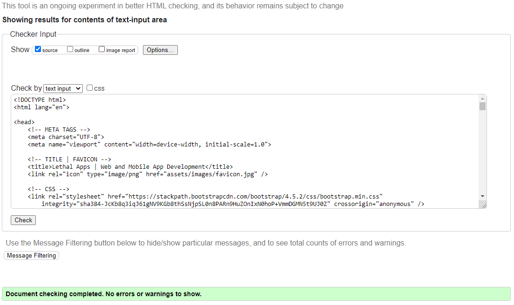
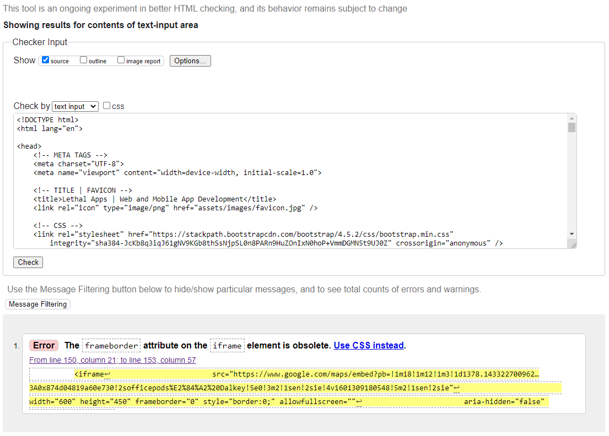
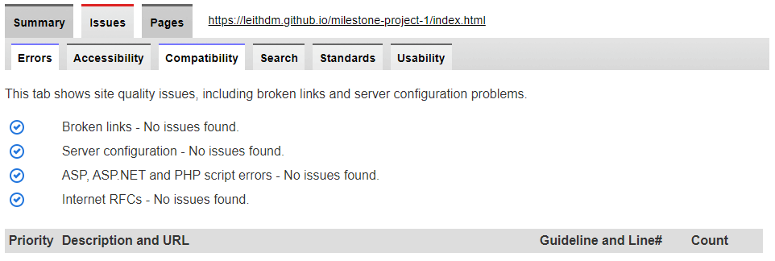
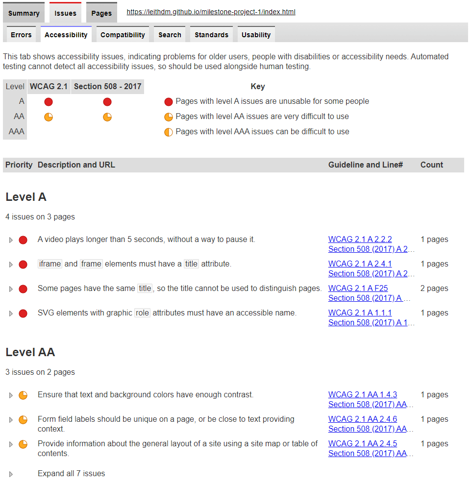
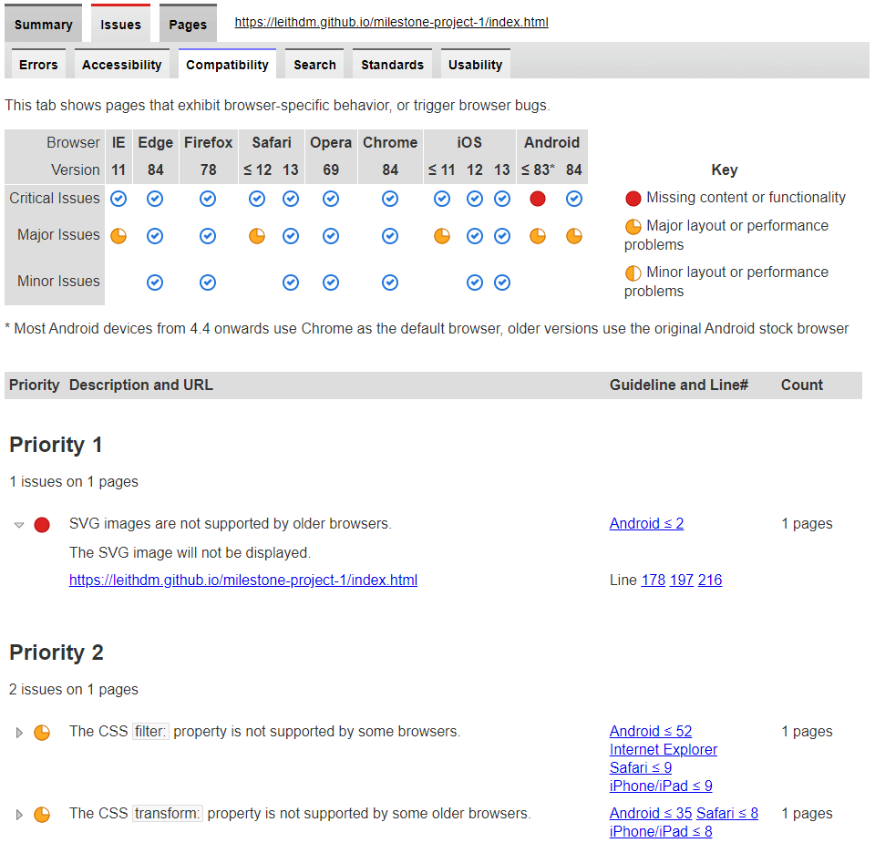
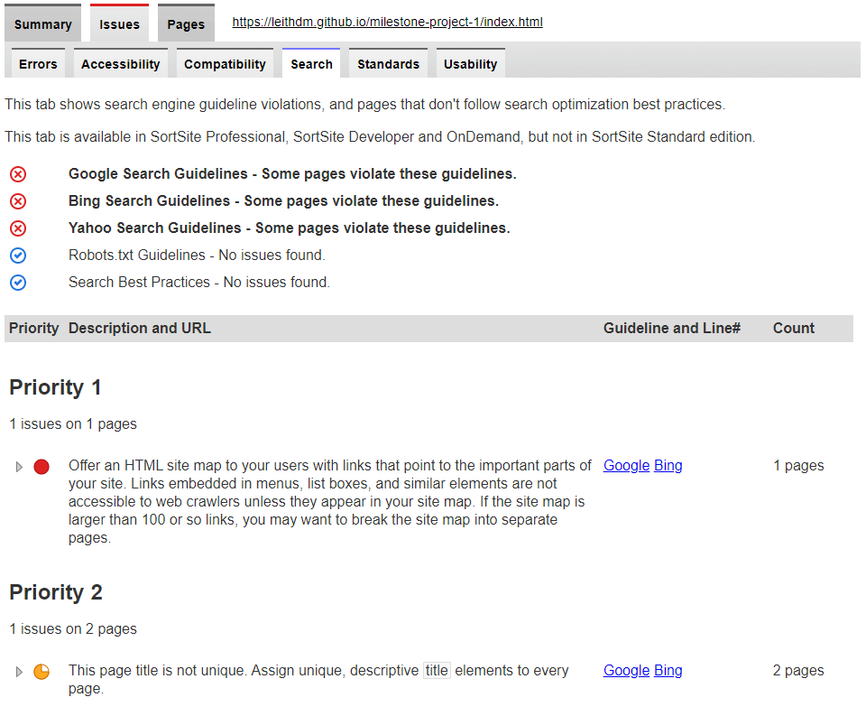
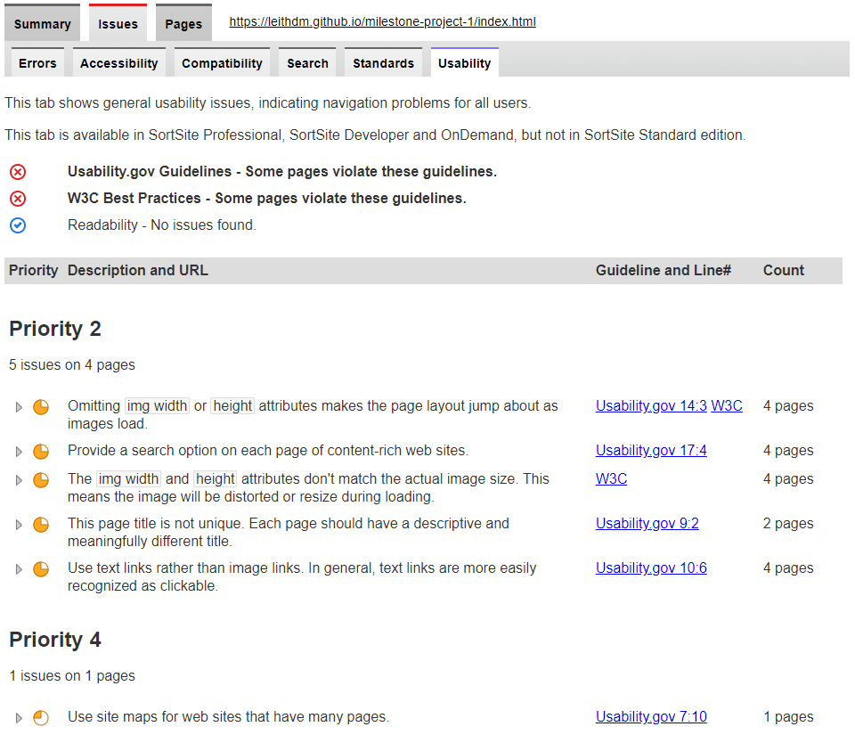
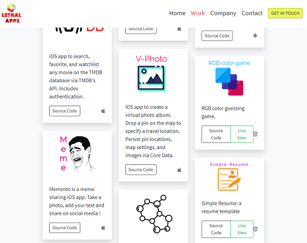
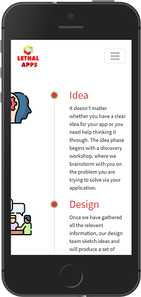
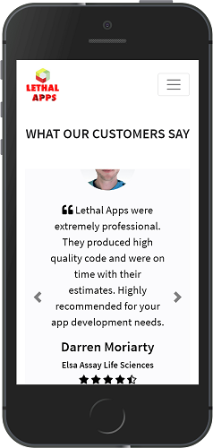

# Testing

## Validators

[W3C HTML Markup Validation Service](https://validator.w3.org/)

- Home Page


Result: No Errors or warnings to show.

- Work Page



Result: No Errors or warnings to show.

- Company Page


Result: No Errors or warnings to show.

- Contact Page



Result: x1 Error related to the 'frameborder' attribute on the 'iframe' element being obsolete. After removing the attribute entirely, the result was No Errors or warnings to show.


[W3C CSS Validation Service](https://jigsaw.w3.org/css-validator/)


Result: No Errors Found. The validator did find x4 generic warnings related to imported style sheets for google fonts and transform extensions for 'ms', 'moz' and 'webkit'. These warnings are ignored. 


## Compatability - Manual Testing

To ensure a broad range of users can successfully use this site, it was manually tested across the 6 major browsers:

- Chrome v.85
- Edge v.85
- Firefox v.81
- Safari v.12
- Opera v.71
- Internet Explorer v.11

To test site responsiveness the following tools were used:

- [Chrome DevTools](https://developers.google.com/web/tools/chrome-devtools)
- [Responsive Design Checker](https://www.responsivedesignchecker.com/)

Below is a table detailing the results of this testing: 


## Compatability - Automated Testing

Automated testing was performed using [PowerMapper](https://www.powermapper.com/). This tool checks websites for broken links, browser compatibility, accessibility, web standards validation, search engine issues, and general usability. 

The results of this testing can be viewed below: 

- Errors


Result: No Errors Found.


- Accessibility


Result: x4 Level A Errors, x3 Level AA Errors.

All of these errors were corrected except for: 
1. 'A video plays longer than 5 seconds, without a way to pause it'. This is in reference to the header videos that display on each of the main website pages. This is a design consideration. This error is ignored.
2. 'Ensure that text and background colors have enough contrast'. This is a design consideration. This error is ignored. 


- Compatibility


Result: SVG images, CSS filter, and CSS transform are not supported by some older browsers. These compatibility problems are accepted, and ignored. Most Android devices from 4.4 onwards use Chrome as the default browser instead of the original Android browswer, and IE and Safari <= 9 are *legacy* browsers.


- Search


Result: Offer an HTML site map, and provide a unique page title to each page. 
Using [XML-SiteMaps](https://www.xml-sitemaps.com/) a site-map was created and added to the root directory. A unique page title was provided to each page. 


- Usability


Result: minor Errors in relation to lack of img-width and img-height attributes making the page layout jumpy when first loading. This error is ignored for this version as its effects are negligible. 


## Testing User stories

Result: All user stories have been successfully implemented, with a :white_check_mark: to denote items that have been implemented in this website. 


"**__As an owner, I__** ______________________________________________"

- :white_check_mark: need a  modern, dynamic website to reflect the values of our company.   
- :white_check_mark: need to ensure customers can use this website to get in Contact.  
- :white_check_mark: need to ensure customers can see a show-case of portfolio work.
- :white_check_mark: must let the customer know about our past successes via testimonials. 

"**__As a user, I__** ______________________________________________"

- :white_check_mark: need to be able to view the site from any device (mobile, tablet, desktop).
- :white_check_mark: should be presented with a site that meets accessibility guidelines including contrast between background and foreground colors, and non-text elements with alt text equivalents.
- :white_check_mark: should be presented with a flow of information-layout and interaction-feedback that is clear and unambiguous.
- :white_check_mark: should have all of my actions confirmed, where appropriate, and feedback should be given at all times.
- :white_check_mark: should be able to view a show-case of previously completed works by the company.
- :white_check_mark: should be able to make further enquiries by filling out an enquiry form.
- :white_check_mark: should be able to see testimonials from other customers that have used the services of this company. 
- :white_check_mark: should be able to read further details on the company, including info on employee, company back-story, company vision, etc. 
- :white_check_mark: my interaction with the site should produce a positive emotional response. I should immediately be drawn-in.

"**__As a developer, I__** ______________________________________________"

- :white_check_mark: must maximise future maintainability through documentation, code structure and organisation.
- :white_check_mark: must document testing fully to include evaluation of bugs found and their fixes and explanation of any bugs that are left unfixed.
- :white_check_mark: must test and deploy a front-end web application to a Cloud platform. HTML/CSS code pass through the official W3C validators with no issues.
- :white_check_mark: must ensure all HTML attribute and CSS rule names are consistent in format, appropriate and meaningful.

## Bugs 

- During development, all known bugs were categorized as *responsiveness* issues, all of which were corrected using media-queries. 

- Bug#1: 
Description: *open source portfolio items are squashed together at 992px*
Reproduce:   
    1. Go to 
    2. Scroll to portfolio open source section
    3. Images and text within each individual card item are squashed.
Expected behaviour:
Fully responsive page with text and images properly spaced and readable. 

Screenshot:

Fix: make use of media queries as per code below: 

```
@media screen and (max-width: 992px) {
  .card-columns {
    column-count: 2;
  }
}

@media screen and (max-width: 768px) {
  .card-columns {
    column-count: 1;
  }
```

- Bug#2: 
Description: *process flow icons are moved off the screen on mobile*
Reproduce:   
    1. Go to 
    2. Scroll to project management > Idea section
    3. Images are off the screen. 
Expected behaviour:
Fully responsive page with images properly spaced and visible. 

Screenshot:

Fix: make use of media queries as per code below:

```
  .timeline-badge {
    position: absolute;
    left: 0;
    width: 80px;
    height: 80px;
    margin-left: -140px;
  }

  .timeline-badge-final {
    position: absolute;
    left: -10px;
    width: 80px;
    height: 80px;
  }
```

- Bug#3: 
Description: *Testimonial text is too large and overflows on mobile*
Reproduce:   
    1. Go to 
    2. Scroll to 'What Our Customers Say' section.
    3. Text overflows its container.
Expected behaviour:
Fully responsive page with text properly spaced and legible. 

Screenshot:

Fix: make use of media queries as per code below:

```
  .testimonial-text {
    font-size: 1rem; 
  }
```

[Go back to README.md file](README.md).

